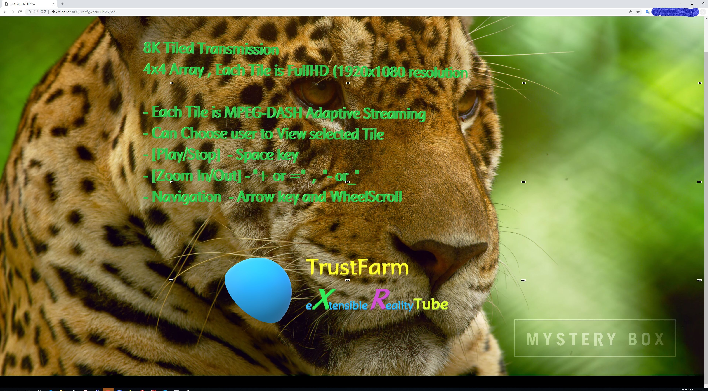
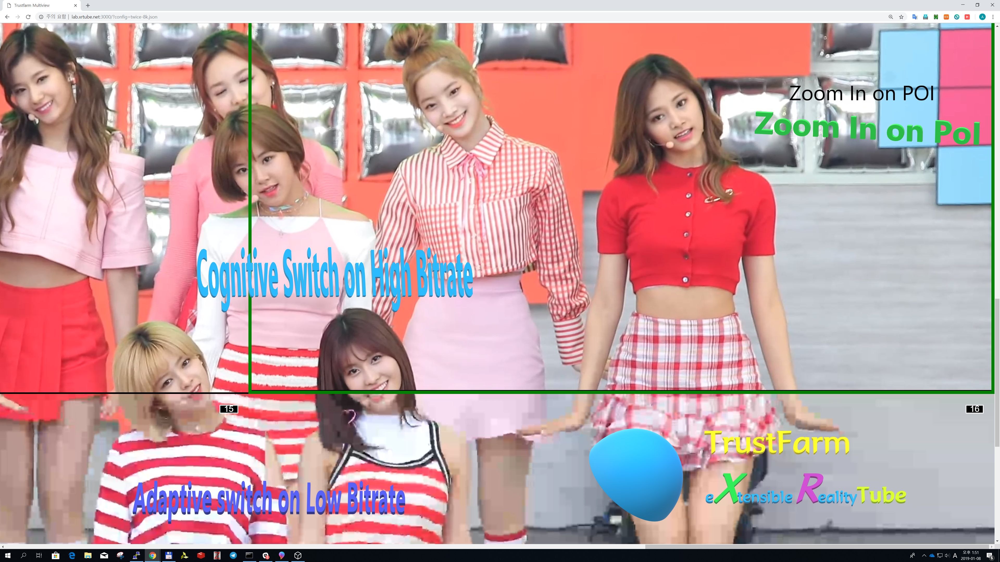

This is a web based XRtube client App. It is Recommended to run in fullscreen mode.

**Best compatible with Chrome browser.**

**In case of Playing 4K, 8K Video, We recommends to PC have latest Video GPU.
Old intel cpu (internal GPU) or Old GPU card have a problem of rendering 4K,8K video frame.
Another Cause is Memory , we recommends larger than 8GB PC Memory. 
It makes not a good rendering quality, it cause from GPU and PC Memory, most of case, not a issue on transfer-rates. 
Even though your network infra is not good , but XRTube MPEG-DASH stack supports adaptive streaming well.  
please enjoy and feedback to issues**
 

 

Demo: http://lab.xrtube.net:3000/?config=twice-8k.json

Some limitations apply:

- Currently not support for DRM protected content as this is often solutions specific to each site
- In ServerSide , DRM contents accepts and ready to transmission.
- On ClientSide , DRM contents compatible with our XRtube-Client App.

# Demo Test Stream Lists [Updated]

Demo1: K-POP Twice IDOL Girl Group
    http://lab.xrtube.net:3000/?config=twice-8k.json

Demo2: Nature of PERU Country 
    http://lab.xrtube.net:3000/?config=peru-8k.json

Demo3: K-POP EXID IDOL Girl Group #2
    http://lab.xrtube.net:3000/?config=exid-4k-2.json

Demo4: K-POP BLACKPINK IDOL Girl Group 마지막처럼
    http://lab.xrtube.net:3000/?config=blackpink-4k-1.json 

Demo5: K-POP BLACKPINK IDOL Girl Group 대학교공연 
    http://lab.xrtube.net:3000/?config=blackpink-4k-2.json 

# Installation

Get the code from Github or fork the repository if you plan to contribute to this project.

		git clone https://github.com/xrtube/xrtube-client.git
		
Install the necessary node modules

		npm install
		
Start the Node express app

		npm start
		
# Usage

When the Node express app is up and running you can direct your Chrome browser to:

		http://lab.xrtube.net:3000/?config=twice-8k.json
		
		or build in localhost, you can play with 
		http://localhost:3000/?config=twice-8k.json
		http://localhost:3000/?config=peru-8k.json
		
		Available Test Stream is except twice-8k.json , peru-8k.json
		
where twice-8k.json and example.json is a configuration file placed in the directory config/ and can look like this:

		{
			"row0": [
				{ "title": "View port title",
				  "manifest": "http://example.com/master.m3u8",
				  "type": "hls" }
			],
			"row1": [
				{ "title": "View port title 2",
				  "manifest": "http://example.com/manifest.mpd",
				  "type": "dash" }
			]
		}

To toggle 'Space' key to Play or Stop. A green border indicates for which Tile(viewport) is selected. 

## Keyboard Shortcuts
- SPACE     : toggle play / pause for all viewports
- '+' or '=' : Zoom In
- '-' or '-' : Zoom out
- mouse click : Select Tile
- F - toggle fullscreen mode
		
# Contribution and Contact

https://trustfarm.io  
https://trustcoinmining.com  

Email : info@trustfarm.io

We are very happy if you want to contribute to this project. Just follow the "normal" procedures and:

1. Fork this repository
2. Create a topic branch in your fork
3. Add feature or fix bug in the topic branch
4. Issue a pull request explaining what has been done

